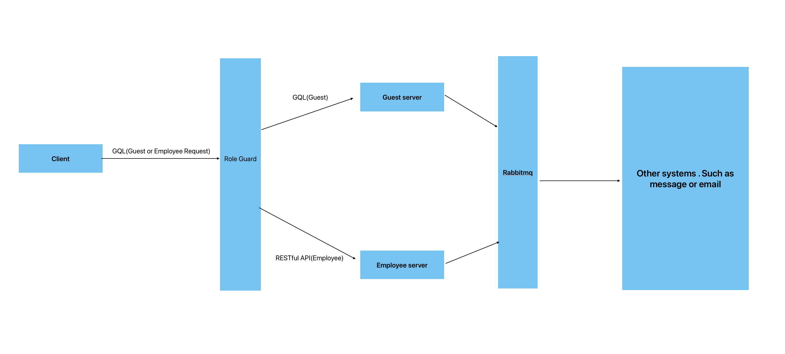

# Hotel Reservation System (HRS)

Project Overview

- hrs_client
  - Tech Stack: The frontend is built using React, Redux, React Router DOM, and MUI for UI components. It includes route guards, API calls are handled with GraphQL, and Vite is used as the build tool.
- hrs_server
  - Tech Stack: The backend is developed using JWT for authentication, GraphQL and RESTfuAPI for API handling, MongoDB as the database, and the Nest.js framework.



- Task List
  1. Guests should able to make reservations.✅
  2. Guests should able to update their reservations.✅
  3. Guests should able to cancel their reservations.✅
  4. Restaurant employees should able to update reservations.❌
  5. Restaurant employees should able to mark a reservation as completed or canceled.❌
  6. Restaurant employees should able to browse all the reservations by date and status.❌
  7. Restaurant employees should able to check reservation detail.✅

## Reflections

Due to time constraints, the project still has several shortcomings. On the employee side, only the UI and GET API calls have been completed. This was my first time using React, so the code is somewhat disorganized, and there are several defects. The backend also shows signs of being rushed; for example, the directory structure is messy. Additionally, there were issues I hadn’t anticipated before starting, such as whether user information should be retrieved from the frontend or the token during validation. I chose the former, which led to illogical validation processes that took significant time to correct later. I also failed to prioritize tasks effectively, resulting in slower development progress.

## Some thoughts (I wanted to implement but haven’t had the time to yet)

In a reservation system, certain operations can be time-consuming or require integration with third-party services (e.g., sending confirmation SMS or emails). By utilizing a message queue, these tasks can be queued and processed asynchronously by background workers, preventing the main thread from being blocked and improving system responsiveness. A delay queue could also be implemented to handle events after a certain period.

- Potential Use Cases:
  1. Sending reservation confirmation emails or SMS.
  2. Sending reminder notifications to guests (e.g., when their reservation time is approaching).
  3. Automatically canceling unconfirmed reservations (e.g., if a reservation is not confirmed within a certain time after booking).

## Installation

Before starting, ensure your Node.js version is v22.0.0+ and that you have pnpm installed (I encountered dependency issues using npm, which prevented the backend from starting). Docker is also required. Since the .env file is not configured, please avoid changing the database username and password.

1. Install MongoDB

```bash
docker run -d \
  --name mongodb \
  -p 27017:27017 \
  -e MONGO_INITDB_ROOT_USERNAME=root \
  -e MONGO_INITDB_ROOT_PASSWORD=root \
  -e MONGO_INITDB_DATABASE=hrs_db \
  mongo
```

2. Verify MongoDB Setup

Once the container is running, you can connect to the database via a MongoDB client or the command line to verify the setup:

```bash
docker exec -it mongodb mongo -u root -p root --authenticationDatabase admin
```

3. Install Dependencies

```
cd hrs_client
pnpm install && npm run dev
```

```
cd hrs_server
pnpm install && npm run start
```

You can access the application at `localhost:5173`. The sign-up link is available at the bottom right corner of the login page, or you can directly visit `localhost:5173/sign-up`. Upon successful registration, you will be redirected to the home page.

4. Create an Employee Account

Since there’s no registration interface for employees, you’ll need to manually create an employee account by visiting localhost:3000/graphql and running the following mutation:

```gql
mutation {
  createAccount(
    userInfo: {
      name: "admin"
      phoneNumber: "888"
      password: "888"
      role: "employee"
    }
  ) {
    id
    access_token
    username
    role
  }
}
```
