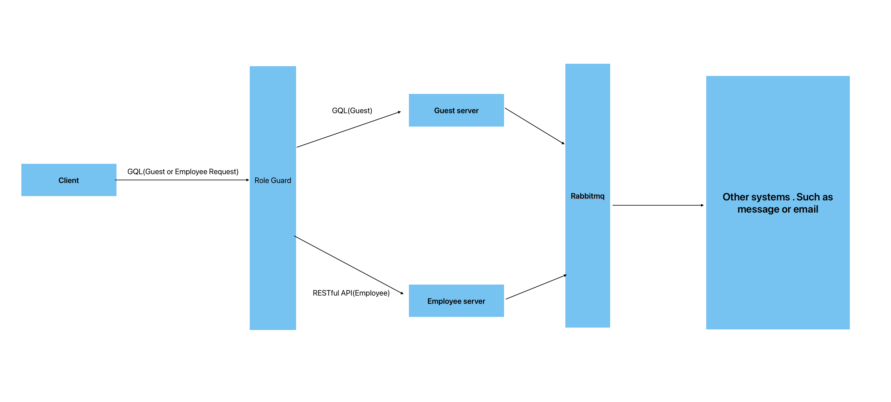

# Hotel Reservation System (HRS)

🏡 [Hotel reservation](http://43.163.103.133/) - **Online Preview**

### Accounts

- **Employee Account**
  - 📱 **Phone number**: 888
  - 🔑 **Password**: 888

- **Guest Account** (You can sign up if you want)
  - 📱 **Phone number**: 1
  - 🔑 **Password**: 1

---

Project Overview

- hrs_client
  - Tech Stack: The frontend is built using React, Redux, React Router DOM, and MUI for UI components. It includes route guards, API calls are handled with GraphQL, and Vite is used as the build tool.
- hrs_server
  - Tech Stack: The backend is developed using JWT for authentication, GraphQL and RESTfuAPI for API handling, MongoDB as the database, and the Nest.js framework.



- Task List

  1. Guests should able to make reservations.✅
  2. Guests should able to update their reservations.✅
  3. Guests should able to cancel their reservations.✅
  4. Restaurant employees should able to update reservations.✅
  5. Restaurant employees should able to mark a reservation as completed or canceled.✅
  6. Restaurant employees should able to browse all the reservations by date and status.✅
  7. Restaurant employees should able to check reservation detail.✅

Due to time constraints, the project still has several shortcomings. On the employee side, only the UI and GET API calls have been completed.

## Some thoughts (I wanted to implement but haven’t had the time to yet)

In a reservation system, certain operations can be time-consuming or require integration with third-party services (e.g., sending confirmation SMS or emails). By utilizing a message queue, these tasks can be queued and processed asynchronously by background workers, preventing the main thread from being blocked and improving system responsiveness. A delay queue could also be implemented to handle events after a certain period.

- Potential Use Cases:
  1. Sending reservation confirmation emails or SMS.
  2. Sending reminder notifications to guests (e.g., when their reservation time is approaching).
  3. Automatically canceling unconfirmed reservations (e.g., if a reservation is not confirmed within a certain time after booking).

## Installation

Before starting, ensure your Node.js version is v22.0.0+ and that you have `pnpm` installed. Docker is also required. Since the .env file is not configured, please avoid changing the database `username` and `password`.
### Local installation
1. Install MongoDB

```bash
docker run -d \
  --name mongodb \
  -p 27017:27017 \
  -e MONGO_INITDB_ROOT_USERNAME=root \
  -e MONGO_INITDB_ROOT_PASSWORD=root \
  -e MONGO_INITDB_DATABASE=hrs_db \
  mongo:latest
```

2. Install Dependencies

```
cd hrs_client
pnpm install && pnpm run dev
```

```
cd hrs_server
pnpm install && pnpm run start
```

You can access the application at `localhost:5173`. The sign-up link is available at the bottom right corner of the login page, or you can directly visit `localhost:5173/sign-up`. Upon successful registration, you will be redirected to the home page.

3. Create an Employee Account

Since there’s no registration interface for employees, you’ll need to manually create an employee account.

```curl
curl -X POST localhost:3000/graphql \
-H "Content-Type: application/json" \
-d '{
  "query": "mutation { createAccount(userInfo: { name: \"admin\", phoneNumber: \"888\", password: \"888\", role: \"employee\" }) { id access_token username role } }"
}'
```

You can use `phone number 888` and `password 888` to access the employee interface.
### Docker installation
1. In the `hrs_client/.env.production` file, make sure the following environment variable is set:
```
VITE_BASE_URL=http://localhost:3000
```
2. Navigate to the project directory and start Docker Compose:
```
cd hotel_reservation
docker compose up --build
```
3. Finally, execute the third step of the `Local installation` to add the admin user.

Since the frontend is bound to port `80` during the Docker build, you can access the page by visiting `localhost`.